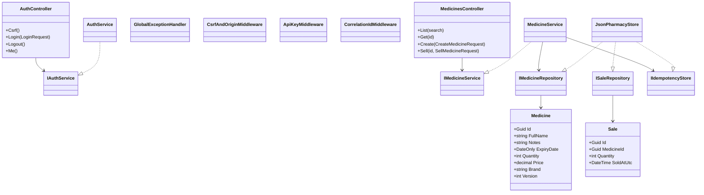
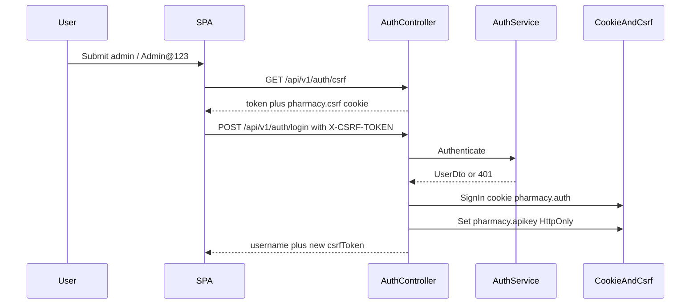
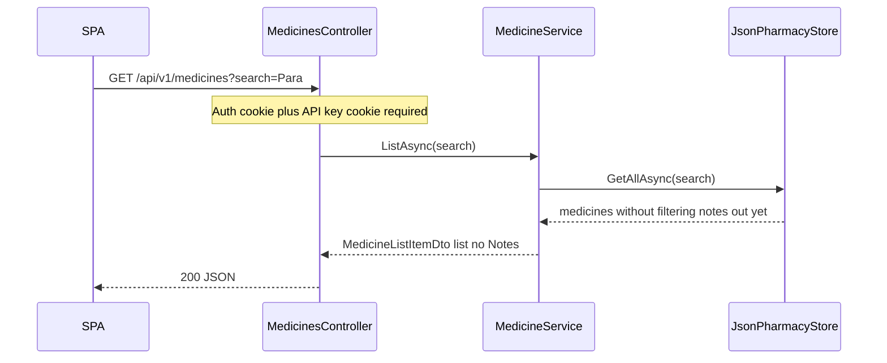
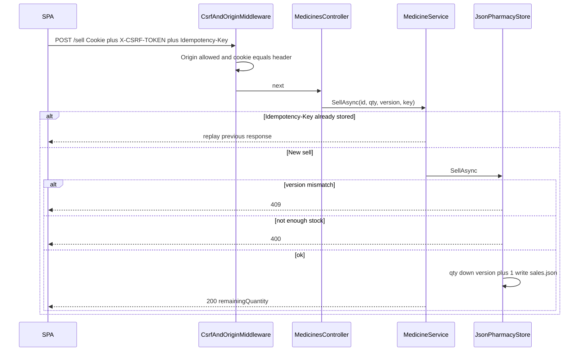
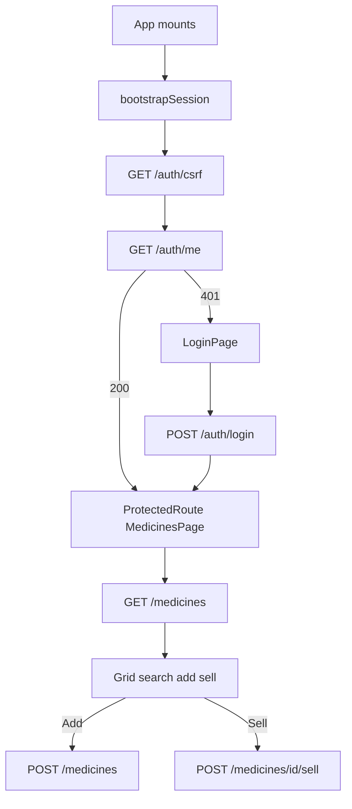

# ABC Pharmacy — Application Guide

This document describes the **backend** and **frontend** of the ABC Pharmacy medicine tracker: what it does, how the code is structured, how requests flow, and how to debug it.

---

## 1. Brief

ABC Pharmacy needs a single-page app to keep an inventory of medicines and record sales.

- **Backend:** ASP.NET Core 10 Web API, layered architecture, data in JSON files (no database).
- **Frontend:** React 19 SPA with Redux Toolkit and Axios.
- **Auth:** Demo login (`admin` / `Admin@123`). No user CRUD.

| Piece | Location | URL |
| --- | --- | --- |
| API | `backend/src/Pharmacy.Api` | http://localhost:5001 |
| Swagger (Development) | same | http://localhost:5001/swagger |
| Web UI | `frontend` | http://localhost:5173 |

JSON files (under `backend/src/Pharmacy.Api/data/`):

- `medicines.json` — inventory
- `sales.json` — sell audit records
- `idempotency.json` — replay cache for create/sell

---

## 2. Features

### Inventory

- List medicines in a grid: **name, brand, expiry, quantity, price** (notes are hidden on the grid).
- Search by medicine name.
- Add a medicine (name, notes, expiry, quantity, price, brand).
- Sell from a row: quantity goes down; a sale is written to `sales.json`.

### Grid colors

- **Red** — expiry date is less than 30 days away (includes already expired).
- **Yellow** — quantity is less than 10.
- If both apply, **red wins**.

### API capabilities

- URL versioning: `/api/v1/...`
- Options pattern for configuration
- Global exception handling + Serilog (stack traces in Development only)
- HTTPS + HSTS in Production only
- API key cookie after login
- Rate limiting
- CORS allowlist
- Correlation id per request
- Concurrency token (`version`) on sell → HTTP 409
- `Idempotency-Key` on create and sell
- Origin check, CSRF, XSS hardening (JSON + headers + no HTML in text fields)

---

# Backend

## 3. Architecture (layers)

```
Pharmacy.Api            Controllers, middleware, Swagger, DI host
Pharmacy.Application    Services, DTOs, FluentValidation, Options
Pharmacy.Domain         Entities and repository contracts
Pharmacy.Infrastructure JSON file store implementing those contracts
```

Request path: **Controller → Service → Repository → JSON file**.

---

## 4. Class diagram



**Notes**

- `JsonPharmacyStore` is a singleton that locks file access with `SemaphoreSlim`.
- `Medicine.Version` is the concurrency token. Sell must send the current version.
- Demo credentials and API key come from `IOptions` (`DemoAuthOptions`, `ApiKeyOptions`).

---

## 5. Sequence diagrams

### 5.1 Login



### 5.2 List medicines (search)



### 5.3 Sell (CSRF + concurrency)



---

## 6. How to debug the API

### Run

```bash
dotnet run --project backend/src/Pharmacy.Api --launch-profile http
```

- API: http://localhost:5001
- Swagger: http://localhost:5001/swagger
- Health: http://localhost:5001/health
- OpenAPI JSON: http://localhost:5001/openapi/v1.json

Set `ASPNETCORE_ENVIRONMENT=Development` (already set in the `http` launch profile) so unhandled errors include **stack traces** in ProblemDetails.

### Breakpoints (Cursor / Visual Studio)

1. Open `backend/Pharmacy.slnx`.
2. Put breakpoints in:
   - `AuthController` / `MedicinesController`
   - `MedicineService` / `AuthService`
   - `CsrfAndOriginMiddleware`, `ApiKeyMiddleware`
   - `JsonPharmacyStore.SellAsync`
   - `GlobalExceptionHandler`
3. Start with the `http` profile (port **5001**).

### Logs

- Console output from Serilog while `dotnet run` is active.
- Rolling files: `backend/src/Pharmacy.Api/logs/pharmacy-YYYYMMDD.log`.
- Each request has `X-Correlation-ID` on the response. Use that id to find the same call in the log.

### Typical status codes

| Code | Meaning |
| --- | --- |
| 400 | Validation, missing `Idempotency-Key`, insufficient stock |
| 401 | Bad login, missing auth, or missing API key cookie |
| 403 | Bad Origin or CSRF header/cookie mismatch |
| 404 | Medicine id not found |
| 409 | Sell `version` did not match (stale row) |
| 429 | Rate limit |

### Swagger tips

1. Call **GET `/api/v1/auth/csrf`** (optional; same-origin Swagger skips CSRF).
2. Call **POST `/api/v1/auth/login`** with `{"username":"admin","password":"Admin@123"}`.
3. Cookies are stored by the browser; then list/add/sell should work.
4. For create/sell, add header `Idempotency-Key` with any unique GUID.

### Data while debugging

Edit or inspect:

- `backend/src/Pharmacy.Api/data/medicines.json`
- `backend/src/Pharmacy.Api/data/sales.json`

Restart is not required; the store reads files on each locked operation. Avoid editing a file at the exact moment of a sell.

---

# Frontend

## 7. Frontend flow

Stack: **React 19**, **React Router**, **Redux Toolkit**, **Axios** (`withCredentials: true`).



### Screens

| Route | Who can open it | What it does |
| --- | --- | --- |
| `/login` | Anyone | Demo sign-in |
| `/` | Authenticated only | Inventory grid |

`ProtectedRoute` reads `state.auth.status`. `unknown` shows a loading line; `anonymous` redirects to `/login`.

### Redux

- `authSlice` — bootstrap, login, logout, session.
- `medicinesSlice` — fetch, create, sell, search text.
- `uiSlice` — toasts.
- `actionLogger` — every action is logged to the browser console in Development (passwords redacted).

### Axios

- Base URL: `VITE_API_BASE_URL` (`http://localhost:5001`).
- Request interceptor: `X-CSRF-TOKEN`, `X-Correlation-ID`.
- Response interceptor: maps ProblemDetails; **401** clears the session (except on login).
- Create/sell send `Idempotency-Key: crypto.randomUUID()`.

### UI error handling

- **Error boundary** around the app for render crashes.
- **Toasts** for API/business errors (400, 409, 429, network).
- **409** on sell refreshes the list so the user sees the latest `version`.

---

## 8. Security handled on the frontend

The SPA does **not** replace API security. It cooperates with it.

| Concern | What the frontend does |
| --- | --- |
| Session | Calls `/auth/csrf` then `/auth/me` on load. Protected routes hide inventory until authenticated. |
| CSRF | Stores the token from JSON (`setCsrfToken`) and sends `X-CSRF-TOKEN` on every Axios request. |
| Cookies | `withCredentials: true` so `pharmacy.auth` and `pharmacy.apikey` are sent. JS never reads the HttpOnly API key. |
| XSS | React escapes text in the grid and forms. No `dangerouslySetInnerHTML`. Notes/name/brand are plain text. |
| Secrets in logs | Logger middleware redacts `password`. |
| API errors | 401 → login; 403 CSRF/origin surfaced as a toast; validation errors shown on forms. |
| Logout | `POST /auth/logout` then clears the in-memory CSRF token. |

What the **backend** still enforces (even if the UI is bypassed): origin allowlist, CSRF match, API key cookie, auth cookie, rate limits, HTML rejected on create, concurrency, idempotency.

---

## 9. How to debug the frontend

1. Start the API first (port 5001), then:

   ```bash
   cd frontend
   npm run dev
   ```

   Open http://localhost:5173.

2. **Browser DevTools → Network**
   - Confirm requests go to `localhost:5001`, not 5173.
   - Confirm `Cookie` and `X-CSRF-TOKEN` on POST.
   - Confirm `Origin: http://localhost:5173`.

3. **Console**
   - Look for `[pharmacy]` action logs (type + redacted payload).
   - Failed thunks show ProblemDetails (`detail`, `correlationId`).

4. **Application → Cookies**
   - Cookies are on **localhost:5001**, not 5173. That is expected.

5. **Common local failures**
   - UI loads but login 403: API not allowing origin, or CSRF token not fetched before POST.
   - Login works, list 401: API key cookie missing (login did not complete).
   - CORS error in console: API is down or origin is not `http://localhost:5173`.

---

## 10. Quick API map

| Method | Path | Auth | Extra |
| --- | --- | --- | --- |
| GET | `/health` | No | |
| GET | `/api/v1/auth/csrf` | No | Issues CSRF cookie + token |
| POST | `/api/v1/auth/login` | No | CSRF; sets auth + API key cookies |
| POST | `/api/v1/auth/logout` | Yes | |
| GET | `/api/v1/auth/me` | Yes | |
| GET | `/api/v1/medicines` | Yes + API key | `?search=` |
| GET | `/api/v1/medicines/{id}` | Yes + API key | Includes notes |
| POST | `/api/v1/medicines` | Yes + API key | CSRF + `Idempotency-Key` |
| POST | `/api/v1/medicines/{id}/sell` | Yes + API key | CSRF + `Idempotency-Key` + `version` |
